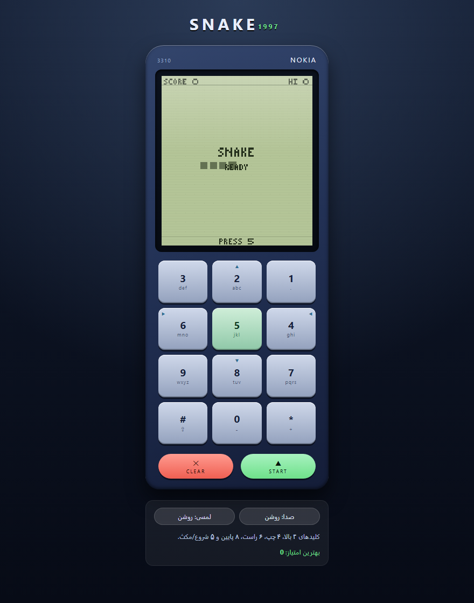

# Snake 1997

Snake game in a Nokia 3310. Pure HTML, CSS and JavaScript. No install, no build.



## Play

| Key | Action |
| --- | --- |
| `2` | Up |
| `4` | Left |
| `6` | Right |
| `8` | Down |
| `5` | Start / Pause |

You can also click the buttons on the phone.

## Run

Open `index.html` in any browser. That is all.

## Files

```
index.html      page and phone markup
css/style.css   phone and keypad styles
js/game.js      game logic and canvas drawing
screenshot.png  screenshot above
```

## Notes

- Works on desktop and mobile (swipe on the screen).
- Sound can be turned off with the sound button.
- Best score is saved in the browser.